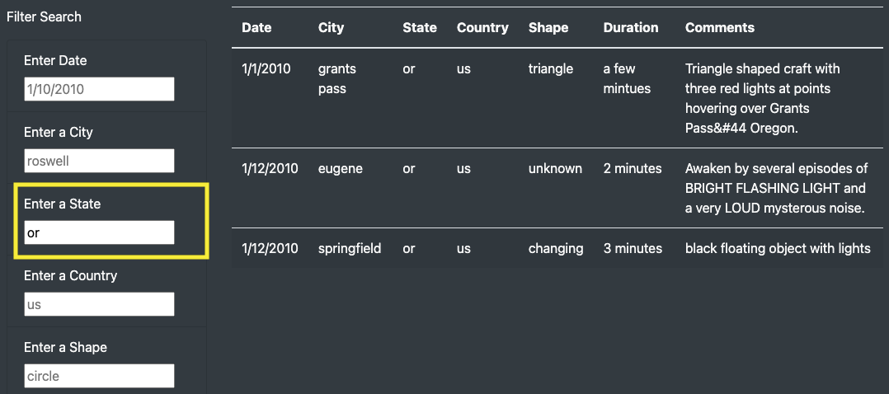
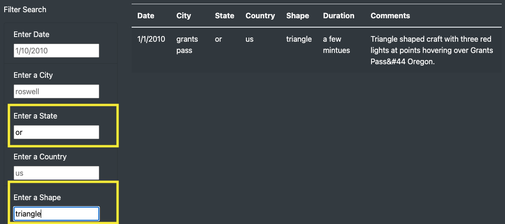
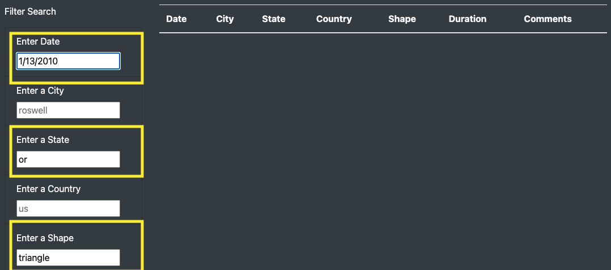

# UFOs
## Overview of Project

The purpose of this assignment was to create a webpage for Dana. The webpage features a heading with an image that adjusts to the window screen. It has a block of text that introduces the data to be presented. Finally, it containsa dynamic table to filter through for UFO sightings. 

## Results

The table uses data from a js file with over 100 entries and allows users to select date, city, state, country, and/or shape and filters the table to those parameters. The user can select one parameter, all, or any in between. To prompt the user on what type of text they should enter, each search bar contains a "placeholder". The placeholder text is grey to indicate that this filter is not currently being applied. The user simply clicks the search bar, enters their search criteria in the corresponding search field, hits enter, and the table automatically filters. 

In the image below, the user has filtered the table for sightings that occurred only in the state of Oregon.

|*Search Results for State: "or"*|
|:--:|
||

In the image below, the user has further filtered the Oregon results to only show sightings that were in the shape of a triangle.

|*Search Results for State: "or", Shape: "triangle"*|
|:--:|
||

In this final image , the user has filtered for state, shape, and date. There aren't any sightings that match these parameters, so the table is blank.

|*Search Results for State: "or", Shape: "triangle", Date: "1/13/2010"*|
|:--:|
||

## Summary

A drawback of this design is that it is unclear what the full dataset contains and if a user enters multiple parameters, they won't know which of them would result in a blank table. My recommendations for futher development are:
- In the "Enter Date" search bar, make the placeholder the date range. Looking through the data.js file, it appears that the sightings are only for 1/1-1/13, so it would be good to put "1/10/2020-1/13/2020" as the placeholder text.
- When parameters are set that don't return any results, instead of having a blank table, it would be useful to add "No results found." to make it clear that the user needs to try other search parameters.
- At the bottom of the search bar table, we should also include a "Clear Fields" button so users don't have to go to each of them and backspace what they had looked up if they want to start a new search.